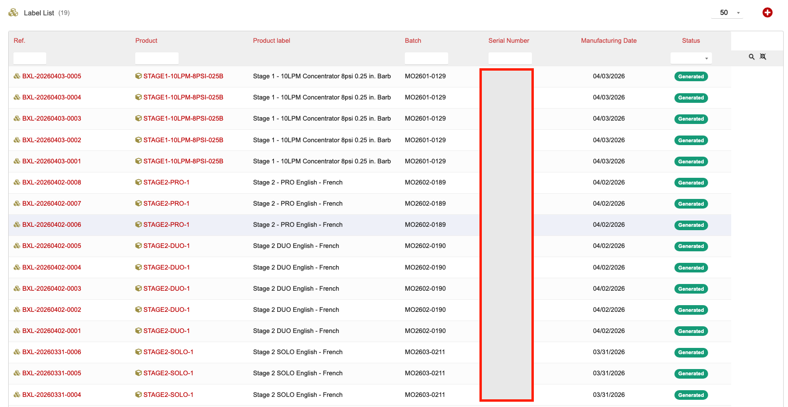
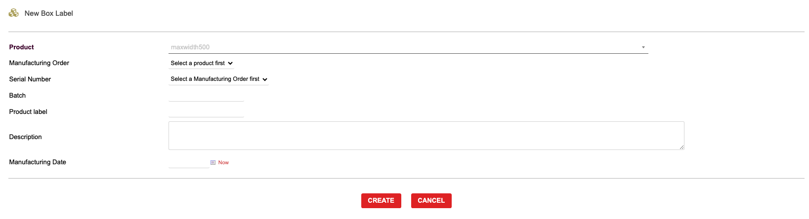
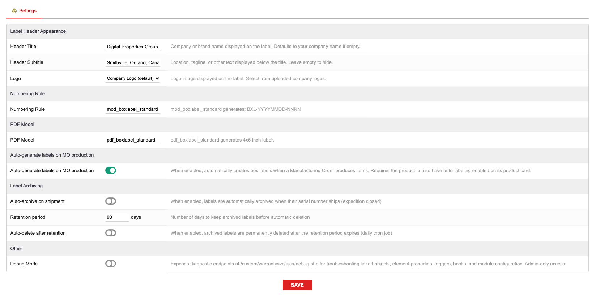

# Boxlabel for Dolibarr

Generate and print 4x6 box labels for Manufacturing Orders in Dolibarr ERP.

**Version:** 1.7.1 | **License:** GPL-3.0 | **Repository:** [github.com/zacharymelo/boxlabel](https://github.com/zacharymelo/boxlabel)

## Features

- Per-product PDF label templates with configurable header (title, subtitle, logo)
- Serial number tracking from MO production batches
- Print All Labels button to generate a combined multi-page PDF from the MO tab
- Auto-generate labels when an MO is produced
- Auto-archive shipped labels with configurable retention period
- Scheduled cleanup cron job for archived labels past their retention period
- Dedicated tab on Manufacturing Order cards showing a badge count of labels
- Label template tab on Product cards for managing per-product templates
- Label numbering format: BXL-YYYYMMDD-NNNN

## Screenshots

| Label List | New Label Form | Admin Setup |
|---|---|---|
|  |  |  |

## Requirements

- Dolibarr 16.0 or higher
- PHP 7.0 or higher
- The following Dolibarr modules must be enabled:
  - **Products**
  - **MRP** (Manufacturing Orders)
  - **Stock** (Warehouse)

## Installation

1. Download the latest release ZIP from the [Releases page](https://github.com/zacharymelo/boxlabel/releases).
2. Log in to Dolibarr as an administrator.
3. Go to **Home > Setup > Modules/Applications**.
4. Click **Deploy/install an external app/module** at the top of the page.
5. Upload the ZIP file and click **Send**.
6. Find **Boxlabel** in the module list and click the toggle to enable it.

## Configuration

After enabling the module, go to **Home > Setup > Modules > Boxlabel Setup** to configure:

- **Header Title** -- The title printed on each label
- **Header Subtitle** -- A subtitle line printed below the title
- **Logo** -- Upload a logo image to include on labels
- **Numbering Rule** -- Controls how label reference numbers are assigned
- **PDF Model** -- Select which PDF template to use for label output
- **Auto-generate on MO production** -- Automatically create labels when a Manufacturing Order is produced
- **Auto-archive on shipment** -- Automatically archive labels when the associated shipment is sent
- **Retention period** -- How long archived labels are kept before cleanup
- **Auto-delete after retention** -- Enable the scheduled cron job to remove archived labels once the retention period has passed

## Usage Guide

### Creating a Label

1. Open a Manufacturing Order card.
2. Click the **Box Labels** tab.
3. Click **New Label** to open the label form.
4. Fill in the required fields (product, quantity, serial numbers).
5. Click **Create** to save the label.

### Printing Labels

- To print a single label, open the label card and click the **Generate PDF** button.
- To print all labels for an MO at once, go to the **Box Labels** tab on the MO card and click **Print All Labels**. This produces a single multi-page PDF containing every label for that order.

### Managing Templates

1. Open a Product card.
2. Click the **Label Template** tab.
3. Configure the header title, subtitle, and logo for labels generated from this product.

### Automatic Workflows

When enabled in the admin setup, labels can be created automatically each time an MO is produced and archived automatically when the related shipment is dispatched. The cleanup cron job runs on a schedule to delete archived labels that have exceeded the configured retention period.

## License

This module is released under the [GNU General Public License v3.0](https://www.gnu.org/licenses/gpl-3.0.html).
